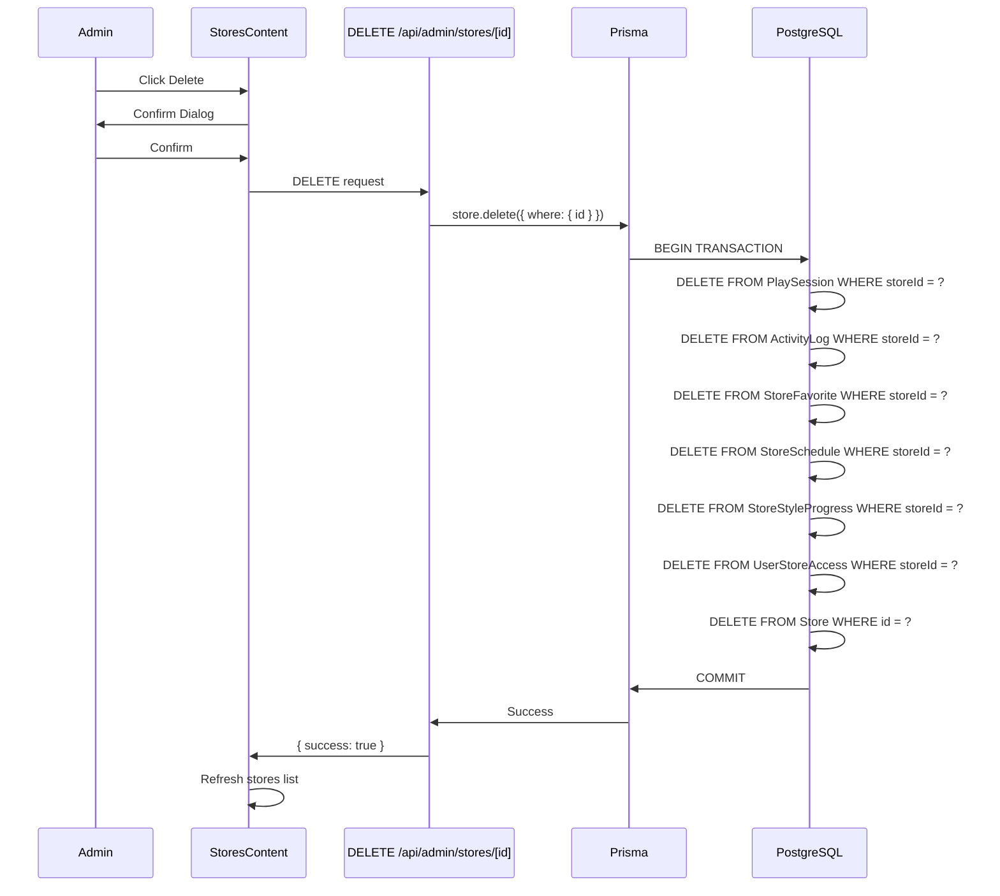

# Design Document: Store Deletion and Precise Tracking

## Overview

Ce document décrit la conception technique pour implémenter deux fonctionnalités critiques de l'admin Aura Music : la suppression fiable des comptes magasins avec cascade delete, et le tracking précis des heures d'écoute avec détection des sessions simultanées.

### Problèmes Actuels

1. **Suppression de Store Échoue Silencieusement**: La suppression d'un store échoue à cause de contraintes de clé étrangère sur `PlaySession` qui n'a pas `onDelete: Cascade` configuré. Les autres relations (ActivityLog, StoreFavorite, etc.) ont déjà le cascade delete, mais PlaySession bloque la suppression.

2. **Tracking Approximatif**: Le calcul des heures d'écoute est approximatif car il n'y a pas de mécanisme pour calculer la durée des sessions actives en temps réel, ni de détection des sessions simultanées.

### Objectifs

- Permettre la suppression complète d'un store avec toutes ses données associées
- Calculer précisément les heures d'écoute réelles (sessions actives + terminées)
- Détecter et afficher les sessions simultanées pour identifier les usages multi-appareils
- Fournir un historique complet des sessions avec export CSV
- Garantir l'intégrité des données de tracking

## Architecture

### Vue d'Ensemble

L'architecture suit le pattern Next.js App Router avec API Routes pour le backend et composants React pour le frontend. Les modifications touchent trois couches :

1. **Couche Base de Données (Prisma)**: Migration du schéma pour ajouter `onDelete: Cascade` sur PlaySession
2. **Couche API (Next.js API Routes)**: Amélioration de l'endpoint DELETE et création de nouveaux endpoints pour les statistiques
3. **Couche Frontend (React)**: Ajout de colonnes et modales pour afficher les statistiques de sessions

### Diagramme d'Architecture

```mermaid
graph TB
    subgraph Frontend
        A[StoresContent.tsx]
        B[SessionsModal.tsx]
    end
    
    subgraph API Layer
        C[DELETE /api/admin/stores/[id]]
        D[GET /api/admin/stores/[id]/sessions]
        E[GET /api/admin/stores/[id]/stats]
    end
    
    subgraph Database
        F[(PostgreSQL)]
        G[Prisma Client]
    end
    
    A -->|Delete Store| C
    A -->|View Sessions| D
    A -->|View Stats| E
    B -->|Export CSV| D
    
    C -->|Delete with Cascade| G
    D -->|Query Sessions| G
    E -->|Calculate Stats| G
    
    G -->|SQL| F
```

### Flux de Suppression



## Components and Interfaces

### 1. Migration Prisma

**Fichier**: `prisma/schema.prisma`

Modification de la relation PlaySession vers Store pour ajouter le cascade delete :

```prisma
model PlaySession {
  id          String     @id @default(uuid())
  storeId     String
  styleId     String
  startedAt   DateTime   @default(now())
  endedAt     DateTime?
  totalPlayed Int        @default(0)
  store       Store      @relation(fields: [storeId], references: [id], onDelete: Cascade)
  style       MusicStyle @relation(fields: [styleId], references: [id])
}
```

**Commande de migration**:
```bash
npx prisma migrate dev --name add-cascade-delete-play-session
```

### 2. API DELETE Améliorée

**Fichier**: `src/app/api/admin/stores/[id]/route.ts`

```typescript
export async function DELETE(
    req: NextRequest,
    { params }: { params: Promise<{ id: string }> }
) {
    const session = await getServerSession(authOptions);

    if (!session || (session.user as any).role !== "ADMIN") {
        return NextResponse.json({ error: "Unauthorized" }, { status: 401 });
    }

    try {
        const { id } = await params;
        
        // Vérifier que le store existe
        const store = await prisma.store.findUnique({
            where: { id },
            select: { id: true, name: true }
        });
        
        if (!store) {
            return NextResponse.json(
                { error: "Store not found" }, 
                { status: 404 }
            );
        }
        
        // Supprimer le store (cascade delete automatique)
        await prisma.store.delete({ where: { id } });
        
        // Logger l'action
        console.log(`Store deleted: ${store.name} (${id})`);
        
        return NextResponse.json({ 
            success: true,
            message: `Store "${store.name}" deleted successfully`
        });
    } catch (error: any) {
        console.error("Delete store error:", error);
        
        // Identifier les erreurs de contrainte
        if (error.code === 'P2003') {
            return NextResponse.json({ 
                error: "Cannot delete store due to foreign key constraint",
                details: error.meta?.field_name
            }, { status: 400 });
        }
        
        return NextResponse.json({ 
            error: "Failed to delete store",
            details: error.message
        }, { status: 500 });
    }
}
```

### 3. API Sessions Statistics

**Fichier**: `src/app/api/admin/stores/[id]/sessions/route.ts`

```typescript
import { NextRequest, NextResponse } from "next/server";
import prisma from "@/lib/prisma";
import { getServerSession } from "next-auth";
import { authOptions } from "@/lib/auth";

export async function GET(
    req: NextRequest,
    { params }: { params: Promise<{ id: string }> }
) {
    const session = await getServerSession(authOptions);

    if (!session || (session.user as any).role !== "ADMIN") {
        return NextResponse.json({ error: "Unauthorized" }, { status: 401 });
    }

    try {
        const { id } = await params;
        const { searchParams } = new URL(req.url);
        const startDate = searchParams.get('startDate');
        const endDate = searchParams.get('endDate');
        const format = searchParams.get('format'); // 'json' or 'csv'
        
        // Construire le filtre de date
        const dateFilter: any = {};
        if (startDate) {
            dateFilter.gte = new Date(startDate);
        }
        if (endDate) {
            dateFilter.lte = new Date(endDate);
        }
        
        // Récupérer toutes les sessions
        const sessions = await prisma.playSession.findMany({
            where: {
                storeId: id,
                ...(Object.keys(dateFilter).length > 0 && {
                    startedAt: dateFilter
                })
            },
            include: {
                style: {
                    select: { name: true }
                }
            },
            orderBy: { startedAt: 'desc' }
        });
        
        // Calculer la durée pour chaque session
        const now = new Date();
        const sessionsWithDuration = sessions.map(session => {
            let duration: number;
            
            if (session.endedAt) {
                // Session terminée : utiliser totalPlayed ou calculer
                duration = session.totalPlayed || 
                    Math.floor((session.endedAt.getTime() - session.startedAt.getTime()) / 1000);
            } else {
                // Session active : calculer depuis startedAt jusqu'à maintenant
                duration = Math.floor((now.getTime() - session.startedAt.getTime()) / 1000);
            }
            
            return {
                id: session.id,
                styleName: session.style.name,
                startedAt: session.startedAt,
                endedAt: session.endedAt,
                duration,
                isActive: !session.endedAt
            };
        });
        
        // Format CSV si demandé
        if (format === 'csv') {
            const csv = [
                'ID,Style,Started At,Ended At,Duration (seconds),Status',
                ...sessionsWithDuration.map(s => 
                    `${s.id},${s.styleName},${s.startedAt.toISOString()},${s.endedAt?.toISOString() || 'Active'},${s.duration},${s.isActive ? 'Active' : 'Completed'}`
                )
            ].join('\n');
            
            return new NextResponse(csv, {
                headers: {
                    'Content-Type': 'text/csv',
                    'Content-Disposition': `attachment; filename="sessions-${id}.csv"`
                }
            });
        }
        
        return NextResponse.json(sessionsWithDuration);
    } catch (error) {
        console.error("Get sessions error:", error);
        return NextResponse.json({ 
            error: "Failed to fetch sessions" 
        }, { status: 500 });
    }
}
```

### 4. API Store Statistics

**Fichier**: `src/app/api/admin/stores/[id]/stats/route.ts`

```typescript
import { NextRequest, NextResponse } from "next/server";
import prisma from "@/lib/prisma";
import { getServerSession } from "next-auth";
import { authOptions } from "@/lib/auth";

export async function GET(
    req: NextRequest,
    { params }: { params: Promise<{ id: string }> }
) {
    const session = await getServerSession(authOptions);

    if (!session || (session.user as any).role !== "ADMIN") {
        return NextResponse.json({ error: "Unauthorized" }, { status: 401 });
    }

    try {
        const { id } = await params;
        
        // Récupérer toutes les sessions
        const sessions = await prisma.playSession.findMany({
            where: { storeId: id },
            select: {
                startedAt: true,
                endedAt: true,
                totalPlayed: true
            }
        });
        
        const now = new Date();
        let totalListeningSeconds = 0;
        let activeSessions = 0;
        
        // Calculer le total et compter les sessions actives
        sessions.forEach(session => {
            if (session.endedAt) {
                // Session terminée
                totalListeningSeconds += session.totalPlayed || 
                    Math.floor((session.endedAt.getTime() - session.startedAt.getTime()) / 1000);
            } else {
                // Session active
                activeSessions++;
                totalListeningSeconds += 
                    Math.floor((now.getTime() - session.startedAt.getTime()) / 1000);
            }
        });
        
        // Convertir en heures
        const totalListeningHours = totalListeningSeconds / 3600;
        
        return NextResponse.json({
            totalSessions: sessions.length,
            activeSessions,
            totalListeningHours: Math.round(totalListeningHours * 100) / 100,
            hasConcurrentSessions: activeSessions > 1
        });
    } catch (error) {
        console.error("Get stats error:", error);
        return NextResponse.json({ 
            error: "Failed to fetch statistics" 
        }, { status: 500 });
    }
}
```

### 5. Frontend: StoresContent avec Sessions

**Fichier**: `src/app/admin/stores/StoresContent.tsx`

Modifications à apporter :

1. Ajouter une colonne "Sessions actives" dans le tableau
2. Ajouter un bouton pour voir l'historique des sessions
3. Afficher un indicateur visuel pour les sessions simultanées
4. Améliorer la gestion d'erreur lors de la suppression

```typescript
interface Store {
    id: string;
    name: string;
    email: string;
    isActive: boolean;
    style?: { name: string } | null;
    createdAt: string;
    stats?: {
        activeSessions: number;
        totalListeningHours: number;
        hasConcurrentSessions: boolean;
    };
}

// Fonction pour charger les stats de chaque store
const fetchStoresWithStats = async () => {
    try {
        const res = await fetch("/api/admin/stores");
        const stores = await res.json();
        
        // Charger les stats pour chaque store
        const storesWithStats = await Promise.all(
            stores.map(async (store: Store) => {
                try {
                    const statsRes = await fetch(`/api/admin/stores/${store.id}/stats`);
                    const stats = await statsRes.json();
                    return { ...store, stats };
                } catch {
                    return store;
                }
            })
        );
        
        setStores(storesWithStats);
    } catch (err) {
        console.error(err);
    } finally {
        setLoading(false);
    }
};

// Améliorer la fonction de suppression
const handleDelete = async (id: string, name: string) => {
    if (!confirm(`Supprimer "${name}" et toutes ses données associées ?`)) return;
    
    try {
        const res = await fetch(`/api/admin/stores/${id}`, { method: "DELETE" });
        const data = await res.json();
        
        if (!res.ok) {
            alert(`Erreur: ${data.error}\n${data.details || ''}`);
            return;
        }
        
        alert(data.message || 'Store supprimé avec succès');
        fetchStoresWithStats();
    } catch (err: any) {
        alert(`Erreur lors de la suppression: ${err.message}`);
    }
};
```

Ajout de la colonne dans le tableau :

```tsx
<thead>
    <tr>
        <th>Magasin</th>
        <th>Email</th>
        <th>Style</th>
        <th>Sessions actives</th>
        <th>Heures d'écoute</th>
        <th>Statut</th>
        <th>Actions</th>
    </tr>
</thead>
<tbody>
    {filteredStores.map(store => (
        <tr key={store.id}>
            <td><span className={styles.storeName}>{store.name}</span></td>
            <td className={styles.email}>{store.email}</td>
            <td><span className={styles.styleBadge}>{store.style?.name || "Aucun"}</span></td>
            <td>
                <span className={clsx(
                    styles.sessionsBadge,
                    store.stats?.hasConcurrentSessions && styles.concurrent
                )}>
                    {store.stats?.activeSessions || 0}
                    {store.stats?.hasConcurrentSessions && " ⚠️"}
                </span>
            </td>
            <td>
                <span className={styles.hours}>
                    {store.stats?.totalListeningHours?.toFixed(1) || "0.0"}h
                </span>
            </td>
            <td>
                <button 
                    onClick={() => handleToggleActive(store)} 
                    className={clsx(
                        styles.statusBadge, 
                        store.isActive ? styles.active : styles.inactive
                    )}
                >
                    {store.isActive ? "Actif" : "Inactif"}
                </button>
            </td>
            <td>
                <div className={styles.actions}>
                    <button 
                        onClick={() => openSessionsModal(store)} 
                        className={styles.actionBtn} 
                        title="Voir les sessions"
                    >
                        <Activity size={16} />
                    </button>
                    <button 
                        onClick={() => openEditModal(store)} 
                        className={styles.actionBtn} 
                        title="Modifier"
                    >
                        <Edit2 size={16} />
                    </button>
                    <button 
                        onClick={() => handleDelete(store.id, store.name)} 
                        className={clsx(styles.actionBtn, styles.deleteBtn)} 
                        title="Supprimer"
                    >
                        <Trash2 size={16} />
                    </button>
                </div>
            </td>
        </tr>
    ))}
</tbody>
```

### 6. Frontend: Sessions Modal

**Fichier**: `src/app/admin/stores/SessionsModal.tsx`

Nouveau composant pour afficher l'historique des sessions :

```typescript
import { useState, useEffect } from "react";
import { X, Download, Calendar } from "lucide-react";
import styles from "./SessionsModal.module.css";

interface Session {
    id: string;
    styleName: string;
    startedAt: string;
    endedAt: string | null;
    duration: number;
    isActive: boolean;
}

interface SessionsModalProps {
    storeId: string;
    storeName: string;
    onClose: () => void;
}

export default function SessionsModal({ storeId, storeName, onClose }: SessionsModalProps) {
    const [sessions, setSessions] = useState<Session[]>([]);
    const [loading, setLoading] = useState(true);
    const [startDate, setStartDate] = useState("");
    const [endDate, setEndDate] = useState("");

    useEffect(() => {
        fetchSessions();
    }, [storeId, startDate, endDate]);

    const fetchSessions = async () => {
        setLoading(true);
        try {
            const params = new URLSearchParams();
            if (startDate) params.append('startDate', startDate);
            if (endDate) params.append('endDate', endDate);
            
            const res = await fetch(`/api/admin/stores/${storeId}/sessions?${params}`);
            const data = await res.json();
            setSessions(data);
        } catch (err) {
            console.error(err);
        } finally {
            setLoading(false);
        }
    };

    const handleExportCSV = () => {
        const params = new URLSearchParams({ format: 'csv' });
        if (startDate) params.append('startDate', startDate);
        if (endDate) params.append('endDate', endDate);
        
        window.location.href = `/api/admin/stores/${storeId}/sessions?${params}`;
    };

    const formatDuration = (seconds: number) => {
        const hours = Math.floor(seconds / 3600);
        const minutes = Math.floor((seconds % 3600) / 60);
        return `${hours}h ${minutes}m`;
    };

    const formatDate = (dateString: string) => {
        return new Date(dateString).toLocaleString('fr-FR');
    };

    return (
        <div className={styles.overlay} onClick={onClose}>
            <div className={styles.modal} onClick={e => e.stopPropagation()}>
                <div className={styles.header}>
                    <h2>Sessions d'écoute - {storeName}</h2>
                    <button onClick={onClose} className={styles.closeBtn}>
                        <X size={20} />
                    </button>
                </div>

                <div className={styles.filters}>
                    <div className={styles.dateFilter}>
                        <Calendar size={18} />
                        <input
                            type="date"
                            value={startDate}
                            onChange={e => setStartDate(e.target.value)}
                            placeholder="Date début"
                        />
                        <span>à</span>
                        <input
                            type="date"
                            value={endDate}
                            onChange={e => setEndDate(e.target.value)}
                            placeholder="Date fin"
                        />
                    </div>
                    <button onClick={handleExportCSV} className="btn-secondary">
                        <Download size={18} />
                        <span>Export CSV</span>
                    </button>
                </div>

                <div className={styles.content}>
                    {loading ? (
                        <div className={styles.loading}>Chargement...</div>
                    ) : sessions.length === 0 ? (
                        <div className={styles.empty}>Aucune session</div>
                    ) : (
                        <table className={styles.table}>
                            <thead>
                                <tr>
                                    <th>Style</th>
                                    <th>Début</th>
                                    <th>Fin</th>
                                    <th>Durée</th>
                                    <th>Statut</th>
                                </tr>
                            </thead>
                            <tbody>
                                {sessions.map(session => (
                                    <tr key={session.id}>
                                        <td>{session.styleName}</td>
                                        <td>{formatDate(session.startedAt)}</td>
                                        <td>
                                            {session.endedAt 
                                                ? formatDate(session.endedAt) 
                                                : <span className={styles.active}>En cours</span>
                                            }
                                        </td>
                                        <td>{formatDuration(session.duration)}</td>
                                        <td>
                                            <span className={session.isActive ? styles.activeBadge : styles.completedBadge}>
                                                {session.isActive ? "Active" : "Terminée"}
                                            </span>
                                        </td>
                                    </tr>
                                ))}
                            </tbody>
                        </table>
                    )}
                </div>

                <div className={styles.footer}>
                    <div className={styles.summary}>
                        Total: {sessions.length} session{sessions.length > 1 ? 's' : ''}
                        {sessions.filter(s => s.isActive).length > 0 && (
                            <span className={styles.activeCount}>
                                {" "}• {sessions.filter(s => s.isActive).length} active{sessions.filter(s => s.isActive).length > 1 ? 's' : ''}
                            </span>
                        )}
                    </div>
                </div>
            </div>
        </div>
    );
}
```

## Data Models

### PlaySession (Modifié)

```prisma
model PlaySession {
  id          String     @id @default(uuid())
  storeId     String
  styleId     String
  startedAt   DateTime   @default(now())
  endedAt     DateTime?
  totalPlayed Int        @default(0)  // Durée en secondes
  store       Store      @relation(fields: [storeId], references: [id], onDelete: Cascade)
  style       MusicStyle @relation(fields: [styleId], references: [id])
}
```

**Changements**:
- Ajout de `onDelete: Cascade` sur la relation `store`

### Store (Inchangé)

Le modèle Store reste identique, mais bénéficie maintenant du cascade delete sur toutes ses relations :
- PlaySession (nouveau)
- ActivityLog (existant)
- StoreFavorite (existant)
- StoreSchedule (existant)
- StoreStyleProgress (existant)
- UserStoreAccess (existant)

### Types TypeScript

```typescript
// Types pour les statistiques de sessions
interface SessionStats {
    totalSessions: number;
    activeSessions: number;
    totalListeningHours: number;
    hasConcurrentSessions: boolean;
}

// Type pour une session avec durée calculée
interface SessionWithDuration {
    id: string;
    styleName: string;
    startedAt: Date;
    endedAt: Date | null;
    duration: number; // en secondes
    isActive: boolean;
}

// Type pour les filtres de date
interface SessionFilters {
    startDate?: string;
    endDate?: string;
}
```


## Correctness Properties

*A property is a characteristic or behavior that should hold true across all valid executions of a system-essentially, a formal statement about what the system should do. Properties serve as the bridge between human-readable specifications and machine-verifiable correctness guarantees.*

### Property Reflection

Après analyse des critères d'acceptation, plusieurs propriétés redondantes ont été identifiées :

**Redondances identifiées** :
- Les critères 1.1 à 1.7 testent tous le même mécanisme de cascade delete sur différentes relations. Ils peuvent être consolidés en une seule propriété globale qui vérifie qu'aucune relation orpheline ne subsiste après suppression.
- Les critères 3.2 et 6.2 testent la même cohérence entre totalPlayed et les timestamps.
- Les critères 7.1 à 7.6 sont des vérifications de schéma qui sont couvertes par les tests de cascade delete.

**Propriétés consolidées** :
- Une propriété unique pour le cascade delete qui vérifie toutes les relations
- Une propriété unique pour la cohérence temporelle des sessions
- Élimination des propriétés de vérification de schéma (couvertes par les tests fonctionnels)

### Property 1: Cascade Delete Completeness

*For any* store with associated data (PlaySession, ActivityLog, StoreFavorite, StoreSchedule, StoreStyleProgress, UserStoreAccess), when the store is deleted, all associated records must be deleted and no orphaned records should remain in the database.

**Validates: Requirements 1.1, 1.2, 1.3, 1.4, 1.5, 1.6, 1.7, 7.1, 7.2, 7.3, 7.4, 7.5, 7.6**

### Property 2: Successful Deletion Response

*For any* store that is successfully deleted, the API must return a 200 status code with a success confirmation message.

**Validates: Requirements 1.8**

### Property 3: Data Integrity on Deletion Failure

*For any* store deletion that fails, the store and all its associated relations must remain unchanged in the database (transaction rollback).

**Validates: Requirements 2.4**

### Property 4: Active Session Duration Calculation

*For any* PlaySession where endedAt is null (active session), the calculated duration must equal the difference in seconds between the current time and startedAt.

**Validates: Requirements 3.1**

### Property 5: Completed Session Duration Consistency

*For any* PlaySession where endedAt is not null (completed session), the totalPlayed value must equal the difference in seconds between endedAt and startedAt.

**Validates: Requirements 3.2, 6.2**

### Property 6: Total Listening Hours Calculation

*For any* store, the total listening hours must equal the sum of all session durations (calculated for active sessions, totalPlayed for completed sessions) divided by 3600.

**Validates: Requirements 3.3**

### Property 7: Active Sessions Count

*For any* store, the count of active sessions must equal the number of PlaySession records where endedAt is null.

**Validates: Requirements 4.1**

### Property 8: Concurrent Sessions Detection

*For any* store, the hasConcurrentSessions flag must be true if and only if the count of active sessions is greater than 1.

**Validates: Requirements 4.2**

### Property 9: Concurrent Sessions Visual Indicator

*For any* store with hasConcurrentSessions set to true, the UI must display a visual indicator (warning icon) in the sessions column.

**Validates: Requirements 4.3**

### Property 10: Sessions List Completeness

*For any* store, the sessions API must return all PlaySession records with their id, styleName, startedAt, endedAt, duration, and isActive fields populated.

**Validates: Requirements 5.1**

### Property 11: Sessions Default Sort Order

*For any* list of sessions returned by the API without explicit sorting parameters, the sessions must be sorted by startedAt in descending order (most recent first).

**Validates: Requirements 5.2**

### Property 12: Sessions Date Filtering

*For any* date range filter (startDate, endDate), the API must return only PlaySession records where startedAt falls within the specified range (inclusive).

**Validates: Requirements 5.3**

### Property 13: CSV Export Format

*For any* store, the CSV export must contain all PlaySession records with columns: ID, Style, Started At, Ended At, Duration (seconds), Status, and proper CSV formatting (comma-separated, quoted strings).

**Validates: Requirements 5.4**

### Property 14: Temporal Consistency

*For any* PlaySession where endedAt is not null, endedAt must be strictly greater than startedAt (no zero or negative duration sessions).

**Validates: Requirements 6.1**

## Error Handling

### Stratégie Globale

L'application adopte une stratégie de gestion d'erreur en trois niveaux :

1. **Niveau Base de Données** : Les contraintes Prisma et PostgreSQL garantissent l'intégrité référentielle
2. **Niveau API** : Les endpoints capturent et transforment les erreurs en réponses HTTP appropriées
3. **Niveau Frontend** : L'interface affiche des messages d'erreur clairs à l'utilisateur

### Erreurs de Suppression

**Cas d'erreur identifiés** :

1. **Store inexistant** (404)
   - Détection : `findUnique` retourne null
   - Réponse : `{ error: "Store not found" }`
   - Action frontend : Afficher un message d'erreur et rafraîchir la liste

2. **Contrainte de clé étrangère** (400)
   - Détection : Code d'erreur Prisma P2003
   - Réponse : `{ error: "Cannot delete store due to foreign key constraint", details: field_name }`
   - Action frontend : Afficher le détail de la contrainte problématique
   - Note : Ne devrait plus se produire après la migration cascade delete

3. **Erreur serveur générique** (500)
   - Détection : Toute autre exception
   - Réponse : `{ error: "Failed to delete store", details: error.message }`
   - Action frontend : Afficher un message d'erreur générique
   - Logging : Console.error avec stack trace complète

### Erreurs de Statistiques

**Cas d'erreur identifiés** :

1. **Store inexistant** (404)
   - Détection : Aucune session trouvée et store n'existe pas
   - Réponse : `{ error: "Store not found" }`
   - Action frontend : Afficher un message d'erreur

2. **Erreur de calcul** (500)
   - Détection : Exception lors du calcul des statistiques
   - Réponse : `{ error: "Failed to fetch statistics" }`
   - Action frontend : Afficher des valeurs par défaut (0)

### Erreurs d'Export CSV

**Cas d'erreur identifiés** :

1. **Paramètres de date invalides** (400)
   - Détection : Date parsing échoue
   - Réponse : `{ error: "Invalid date format" }`
   - Action frontend : Afficher un message d'erreur de validation

2. **Erreur de génération CSV** (500)
   - Détection : Exception lors de la génération du CSV
   - Réponse : `{ error: "Failed to generate CSV export" }`
   - Action frontend : Afficher un message d'erreur

### Validation des Données

**Règles de validation** :

1. **PlaySession** :
   - `startedAt` doit être une date valide
   - `endedAt` doit être null ou postérieur à `startedAt`
   - `totalPlayed` doit être >= 0
   - Si `endedAt` existe, `totalPlayed` doit correspondre à la différence

2. **Filtres de date** :
   - Format ISO 8601 requis
   - `startDate` doit être antérieur ou égal à `endDate`

### Logging

**Stratégie de logging** :

1. **Succès de suppression** :
   ```typescript
   console.log(`Store deleted: ${store.name} (${id})`);
   ```

2. **Erreurs de suppression** :
   ```typescript
   console.error("Delete store error:", error);
   ```

3. **Erreurs de statistiques** :
   ```typescript
   console.error("Get stats error:", error);
   ```

4. **Erreurs de sessions** :
   ```typescript
   console.error("Get sessions error:", error);
   ```

## Testing Strategy

### Approche Duale

Cette fonctionnalité nécessite une combinaison de tests unitaires et de tests basés sur les propriétés :

- **Tests unitaires** : Cas spécifiques, cas limites, gestion d'erreur
- **Tests de propriétés** : Vérification des propriétés universelles sur des données générées

### Tests Unitaires

**Fichier** : `src/app/api/admin/stores/[id]/route.test.ts`

Tests spécifiques pour l'API DELETE :

1. **Suppression réussie d'un store sans relations**
   - Créer un store vide
   - Appeler DELETE
   - Vérifier le statut 200 et le message de succès
   - Vérifier que le store n'existe plus

2. **Suppression d'un store avec PlaySession**
   - Créer un store avec 3 PlaySession
   - Appeler DELETE
   - Vérifier que le store et toutes les PlaySession sont supprimés

3. **Erreur 404 pour store inexistant**
   - Appeler DELETE avec un ID invalide
   - Vérifier le statut 404 et le message d'erreur

4. **Erreur 401 pour utilisateur non autorisé**
   - Appeler DELETE sans session admin
   - Vérifier le statut 401

**Fichier** : `src/app/api/admin/stores/[id]/stats/route.test.ts`

Tests spécifiques pour les statistiques :

1. **Calcul correct avec sessions terminées uniquement**
   - Créer un store avec 2 sessions terminées (1h et 2h)
   - Vérifier que totalListeningHours = 3.0

2. **Calcul correct avec sessions actives**
   - Créer un store avec 1 session active depuis 30 minutes
   - Vérifier que la durée calculée est ~1800 secondes

3. **Détection de sessions simultanées**
   - Créer un store avec 2 sessions actives
   - Vérifier que activeSessions = 2 et hasConcurrentSessions = true

4. **Store sans sessions**
   - Créer un store sans PlaySession
   - Vérifier que toutes les statistiques sont à 0

**Fichier** : `src/app/api/admin/stores/[id]/sessions/route.test.ts`

Tests spécifiques pour l'historique :

1. **Récupération de toutes les sessions**
   - Créer un store avec 5 sessions
   - Vérifier que l'API retourne les 5 sessions

2. **Tri par date décroissante**
   - Créer des sessions avec différentes dates
   - Vérifier l'ordre de retour

3. **Filtrage par date**
   - Créer des sessions sur plusieurs jours
   - Filtrer par une plage de dates
   - Vérifier que seules les sessions dans la plage sont retournées

4. **Export CSV**
   - Créer des sessions
   - Appeler l'API avec format=csv
   - Vérifier le format et le contenu du CSV

### Tests de Propriétés

**Bibliothèque** : `fast-check` (pour TypeScript/JavaScript)

**Configuration** : Minimum 100 itérations par test

**Fichier** : `src/app/api/admin/stores/[id]/route.property.test.ts`

```typescript
import fc from 'fast-check';

describe('Store Deletion Properties', () => {
    it('Property 1: Cascade Delete Completeness', () => {
        // Feature: store-deletion-and-precise-tracking, Property 1
        fc.assert(
            fc.asyncProperty(
                fc.record({
                    playSessions: fc.array(fc.record({ styleId: fc.uuid() })),
                    activityLogs: fc.array(fc.record({ action: fc.string() })),
                    favorites: fc.array(fc.record({ styleId: fc.uuid() }))
                }),
                async (storeData) => {
                    // Créer un store avec les relations
                    const store = await createStoreWithRelations(storeData);
                    
                    // Supprimer le store
                    await deleteStore(store.id);
                    
                    // Vérifier qu'aucune relation orpheline ne reste
                    const orphanedSessions = await countPlaySessions(store.id);
                    const orphanedLogs = await countActivityLogs(store.id);
                    const orphanedFavorites = await countFavorites(store.id);
                    
                    expect(orphanedSessions).toBe(0);
                    expect(orphanedLogs).toBe(0);
                    expect(orphanedFavorites).toBe(0);
                }
            ),
            { numRuns: 100 }
        );
    });

    it('Property 3: Data Integrity on Deletion Failure', () => {
        // Feature: store-deletion-and-precise-tracking, Property 3
        fc.assert(
            fc.asyncProperty(
                fc.record({
                    name: fc.string(),
                    email: fc.emailAddress(),
                    playSessions: fc.array(fc.record({ styleId: fc.uuid() }))
                }),
                async (storeData) => {
                    // Créer un store
                    const store = await createStoreWithRelations(storeData);
                    const initialSessionCount = storeData.playSessions.length;
                    
                    // Simuler une erreur (par exemple, ID invalide)
                    try {
                        await deleteStore('invalid-id');
                    } catch (error) {
                        // L'erreur est attendue
                    }
                    
                    // Vérifier que le store original existe toujours
                    const storeExists = await storeStillExists(store.id);
                    const sessionCount = await countPlaySessions(store.id);
                    
                    expect(storeExists).toBe(true);
                    expect(sessionCount).toBe(initialSessionCount);
                }
            ),
            { numRuns: 100 }
        );
    });
});
```

**Fichier** : `src/app/api/admin/stores/[id]/stats/route.property.test.ts`

```typescript
import fc from 'fast-check';

describe('Session Statistics Properties', () => {
    it('Property 4: Active Session Duration Calculation', () => {
        // Feature: store-deletion-and-precise-tracking, Property 4
        fc.assert(
            fc.asyncProperty(
                fc.record({
                    startedAt: fc.date({ min: new Date('2024-01-01'), max: new Date() }),
                    styleId: fc.uuid()
                }),
                async (sessionData) => {
                    // Créer une session active
                    const session = await createActiveSession(sessionData);
                    
                    // Calculer la durée
                    const now = new Date();
                    const expectedDuration = Math.floor(
                        (now.getTime() - session.startedAt.getTime()) / 1000
                    );
                    
                    // Récupérer les stats
                    const stats = await getSessionStats(session.storeId);
                    const actualDuration = stats.sessions[0].duration;
                    
                    // Tolérance de 1 seconde pour le temps d'exécution
                    expect(Math.abs(actualDuration - expectedDuration)).toBeLessThanOrEqual(1);
                }
            ),
            { numRuns: 100 }
        );
    });

    it('Property 5: Completed Session Duration Consistency', () => {
        // Feature: store-deletion-and-precise-tracking, Property 5
        fc.assert(
            fc.asyncProperty(
                fc.record({
                    startedAt: fc.date({ min: new Date('2024-01-01'), max: new Date() }),
                    durationSeconds: fc.integer({ min: 60, max: 7200 }),
                    styleId: fc.uuid()
                }),
                async (sessionData) => {
                    // Créer une session terminée
                    const endedAt = new Date(
                        sessionData.startedAt.getTime() + sessionData.durationSeconds * 1000
                    );
                    const session = await createCompletedSession({
                        ...sessionData,
                        endedAt,
                        totalPlayed: sessionData.durationSeconds
                    });
                    
                    // Vérifier la cohérence
                    const expectedDuration = Math.floor(
                        (endedAt.getTime() - sessionData.startedAt.getTime()) / 1000
                    );
                    
                    expect(session.totalPlayed).toBe(expectedDuration);
                }
            ),
            { numRuns: 100 }
        );
    });

    it('Property 6: Total Listening Hours Calculation', () => {
        // Feature: store-deletion-and-precise-tracking, Property 6
        fc.assert(
            fc.asyncProperty(
                fc.array(
                    fc.record({
                        durationSeconds: fc.integer({ min: 60, max: 7200 }),
                        isActive: fc.boolean()
                    }),
                    { minLength: 1, maxLength: 10 }
                ),
                async (sessionsData) => {
                    // Créer un store avec plusieurs sessions
                    const store = await createStoreWithSessions(sessionsData);
                    
                    // Calculer le total attendu
                    const expectedTotalSeconds = sessionsData.reduce(
                        (sum, s) => sum + s.durationSeconds,
                        0
                    );
                    const expectedHours = expectedTotalSeconds / 3600;
                    
                    // Récupérer les stats
                    const stats = await getStoreStats(store.id);
                    
                    // Tolérance pour les arrondis
                    expect(Math.abs(stats.totalListeningHours - expectedHours)).toBeLessThan(0.01);
                }
            ),
            { numRuns: 100 }
        );
    });

    it('Property 8: Concurrent Sessions Detection', () => {
        // Feature: store-deletion-and-precise-tracking, Property 8
        fc.assert(
            fc.asyncProperty(
                fc.integer({ min: 0, max: 5 }),
                async (activeSessionCount) => {
                    // Créer un store avec N sessions actives
                    const store = await createStoreWithActiveSessions(activeSessionCount);
                    
                    // Récupérer les stats
                    const stats = await getStoreStats(store.id);
                    
                    // Vérifier la détection
                    expect(stats.activeSessions).toBe(activeSessionCount);
                    expect(stats.hasConcurrentSessions).toBe(activeSessionCount > 1);
                }
            ),
            { numRuns: 100 }
        );
    });

    it('Property 14: Temporal Consistency', () => {
        // Feature: store-deletion-and-precise-tracking, Property 14
        fc.assert(
            fc.asyncProperty(
                fc.record({
                    startedAt: fc.date({ min: new Date('2024-01-01'), max: new Date() }),
                    durationSeconds: fc.integer({ min: 1, max: 7200 })
                }),
                async (sessionData) => {
                    // Créer une session terminée
                    const endedAt = new Date(
                        sessionData.startedAt.getTime() + sessionData.durationSeconds * 1000
                    );
                    const session = await createCompletedSession({
                        ...sessionData,
                        endedAt
                    });
                    
                    // Vérifier la cohérence temporelle
                    expect(session.endedAt.getTime()).toBeGreaterThan(
                        session.startedAt.getTime()
                    );
                }
            ),
            { numRuns: 100 }
        );
    });
});
```

**Fichier** : `src/app/api/admin/stores/[id]/sessions/route.property.test.ts`

```typescript
import fc from 'fast-check';

describe('Session History Properties', () => {
    it('Property 11: Sessions Default Sort Order', () => {
        // Feature: store-deletion-and-precise-tracking, Property 11
        fc.assert(
            fc.asyncProperty(
                fc.array(
                    fc.record({
                        startedAt: fc.date({ min: new Date('2024-01-01'), max: new Date() }),
                        durationSeconds: fc.integer({ min: 60, max: 3600 })
                    }),
                    { minLength: 2, maxLength: 10 }
                ),
                async (sessionsData) => {
                    // Créer un store avec plusieurs sessions
                    const store = await createStoreWithSessions(sessionsData);
                    
                    // Récupérer les sessions
                    const sessions = await getSessions(store.id);
                    
                    // Vérifier l'ordre
                    for (let i = 0; i < sessions.length - 1; i++) {
                        expect(sessions[i].startedAt.getTime()).toBeGreaterThanOrEqual(
                            sessions[i + 1].startedAt.getTime()
                        );
                    }
                }
            ),
            { numRuns: 100 }
        );
    });

    it('Property 12: Sessions Date Filtering', () => {
        // Feature: store-deletion-and-precise-tracking, Property 12
        fc.assert(
            fc.asyncProperty(
                fc.record({
                    sessions: fc.array(
                        fc.record({
                            startedAt: fc.date({ min: new Date('2024-01-01'), max: new Date('2024-12-31') })
                        }),
                        { minLength: 5, maxLength: 20 }
                    ),
                    filterStart: fc.date({ min: new Date('2024-03-01'), max: new Date('2024-06-01') }),
                    filterEnd: fc.date({ min: new Date('2024-06-01'), max: new Date('2024-09-01') })
                }),
                async (data) => {
                    // Créer un store avec plusieurs sessions
                    const store = await createStoreWithSessions(data.sessions);
                    
                    // Filtrer les sessions
                    const filteredSessions = await getSessions(
                        store.id,
                        data.filterStart,
                        data.filterEnd
                    );
                    
                    // Vérifier que toutes les sessions sont dans la plage
                    filteredSessions.forEach(session => {
                        expect(session.startedAt.getTime()).toBeGreaterThanOrEqual(
                            data.filterStart.getTime()
                        );
                        expect(session.startedAt.getTime()).toBeLessThanOrEqual(
                            data.filterEnd.getTime()
                        );
                    });
                }
            ),
            { numRuns: 100 }
        );
    });

    it('Property 13: CSV Export Format', () => {
        // Feature: store-deletion-and-precise-tracking, Property 13
        fc.assert(
            fc.asyncProperty(
                fc.array(
                    fc.record({
                        styleName: fc.string({ minLength: 1, maxLength: 50 }),
                        startedAt: fc.date(),
                        durationSeconds: fc.integer({ min: 60, max: 7200 })
                    }),
                    { minLength: 1, maxLength: 10 }
                ),
                async (sessionsData) => {
                    // Créer un store avec plusieurs sessions
                    const store = await createStoreWithSessions(sessionsData);
                    
                    // Exporter en CSV
                    const csv = await exportSessionsCSV(store.id);
                    
                    // Vérifier le format
                    const lines = csv.split('\n');
                    expect(lines[0]).toBe('ID,Style,Started At,Ended At,Duration (seconds),Status');
                    expect(lines.length).toBe(sessionsData.length + 1); // +1 pour le header
                    
                    // Vérifier que chaque ligne a le bon nombre de colonnes
                    lines.slice(1).forEach(line => {
                        const columns = line.split(',');
                        expect(columns.length).toBe(6);
                    });
                }
            ),
            { numRuns: 100 }
        );
    });
});
```

### Tests d'Intégration

**Fichier** : `tests/integration/store-deletion.test.ts`

Tests end-to-end pour vérifier le comportement complet :

1. **Scénario complet de suppression**
   - Créer un store via l'API
   - Ajouter des PlaySession, ActivityLog, etc.
   - Supprimer le store via l'API
   - Vérifier que toutes les données sont supprimées

2. **Scénario de statistiques en temps réel**
   - Créer un store
   - Démarrer une session
   - Attendre 10 secondes
   - Vérifier que les statistiques reflètent la durée correcte

3. **Scénario de sessions simultanées**
   - Créer un store
   - Démarrer 2 sessions simultanées
   - Vérifier que l'indicateur de sessions simultanées est affiché

### Couverture de Tests

**Objectifs** :
- Couverture de code : > 80%
- Couverture des propriétés : 100% (toutes les propriétés testées)
- Couverture des cas d'erreur : 100% (tous les cas d'erreur testés)

**Outils** :
- Jest pour les tests unitaires et de propriétés
- fast-check pour la génération de données aléatoires
- Supertest pour les tests d'API
- Playwright pour les tests E2E du frontend (optionnel)
